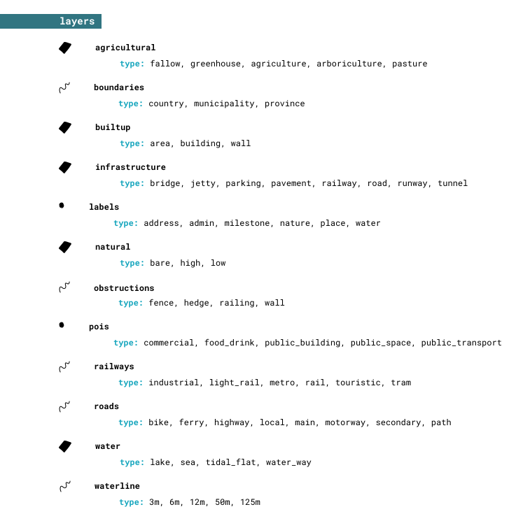

# Cartiqo Technical Specs

Cartiqo is a Vector Tile product based on open source geo data of the Netherlands. It provides a full and detailed map of the Netherlands customizable to your own likes. 

Have a look at [cartiqo.nl](https://cartiqo.nl/). 

Cartiqo is hosted at our partner [Maptiler](https://cloud.maptiler.com/tiles/nl-cartiqo/).

## Vector Tile Contents

1. [Philosophy](#Philosophy)
2. [Layer overview](#Layers)
3. [Fields explanation](#Fields)
4. [Source data](#Source-Data )
5. [In depth description of data layers](#Data-Layers)
6. [In depth description per zoom level](#Data-per-Zoom-Level)

### Philosophy

The Cartiqo vector tiles are build with the aim to have as less as possible styling rules to create a clear map. Data rearrangement decisions are always made with a cartographic goal in mind. 

In theory it will be possible to style a map by simply assigning one color per layer and you will be done. For example, blue for water, green for nature and grey for built-up areas. This would already give you a pretty good map. 

To add more cartographic detail to the map a distinction can be made by the `type` in the layer. The `type` is the first main division that can be given to a layer which is interesting for cartographic reasons. Like natural is divided in high vegetation and low vegetation, a main distinction for the use of dark green and lighter shades of green.

Even more detail can be found when using the `subtypes`. This is a subdivision of the `type`.

### Layers
A quick overview:

### Fields

All layers contain the following general fields:

1. [`originalid`](#originalid)
2. [`type`](#type)

And possibly contain the following fields:

3. [`name`](#name)
4. [`subtype`](#subtype)
5. [`subsubtype`](#subsubtype)

*Not every layer has the same amount of subdevisions. All layers contain `type`, most also contain a `subtype` and some even contain a `subsubtype` when needed.* 

###### `originalid` 
The `originalid` contains the feature id from the original data set. This can be the Natural Earth data set, Top10NL, BGT or even OSM ID's. No transformation is done on this number. When the `originalid` is missing it means a custom geometric transformation (other than simplification) on the feature has occurred, like merging features or transformation from polygon to line. These new features can therefore not be mapped back to its original source.

###### `name`
The Dutch name of the feature if provided by the source data. 

##### `type`
The main type of the feature. First main sub-division of the data for cartographic purposes.

##### `subtype`
This is a subdevision of the `type`. So more detail can be found when using the `subtypes`.

### Source Data 

Cartiqo is a data model build from a combination of several data sets and transformed into homogeneous thematic data layers with recognizable names and types. The model is designed to quickly style the data in a comprehensive way covering all zoom levels. No knowledge from the source data sets is needed to understand the Cartiqo data model. 

The combination of data sets and layers on each zoom level is chosen to our best opinion to provide a good and complete map of the Netherlands. Sometimes these choices are a tradeoff between detailed data or simplified features, to keep the tiles small and fast. 

The following sources are used: 

* [Basis Registratie Grootschalige Topografie (BGT)](https://www.geobasisregistraties.nl/basisregistraties/grootschalige-topografie)
* [Basis Registratie Topografie (BRT)](https://www.geobasisregistraties.nl/basisregistraties/topografie)
    * Top10NL
    * Top50NL
    * Top100NL
    * Top250NL
    * Top500NL
    * Top1000NL
* [Basis Registratie Adressen en Gebouwen (BAG)](https://www.geobasisregistraties.nl/basisregistraties/adressen-en-gebouwen)
* [CBS](https://www.cbs.nl/nl-nl/reeksen/geografische-data) 
* [Natural Earth data](https://www.naturalearthdata.com/)
* [Open Street Map (OSM)](https://www.openstreetmap.org/)

The BGT, BRT and BAG datasets are imported with [NLExtract](https://nlextract.nl/).

The OSM data is imported with the help of the [OpenMaptiles](https://github.com/openmaptiles/openmaptiles/) stack and schema. So the OSM data is already preprocessed and can be handled more easy and quicker.  

Natural Earth data is downloaded form [the website](https://www.naturalearthdata.com/). All large, medium and small scale data. 

CBS data form the [cbs website](https://www.cbs.nl/nl-nl/dossier/nederland-regionaal/geografische-data)

In the following 2 chapters we will explain the data per layer and per zoom level. Also mentioning which source data is included. 
This is useful for writing a map style and allows for alternative use of the data stack. 

### Thematic Data Layers

This is the vector tile schema describing how the thematic data layers are organized and which attributes and attributes values they have. This is useful for writing a map style.

* [`agricultural`](#agricultural)
* [`boundaries`](#boundaries)
* [`builtup`](#builtup)
* [`infrastructure`](#infrastructure)
* [`labels`](#labels)
* [`natural`](#natural)
* [`obstructions`](#obstructions)
* [`pois`](#pois)
* [`railways`](#railways)
* [`roads`](#roads)
* [`water`](#water)
* [`waterline`](#waterline)

------------------------------------------------------

#### `agricultural` (polygon)

All fields for agricultural purposes, including pastures, greenhouses, arboriculture and fallow. Together with the layers **`builtup`**, **`infrastructure`** and **`natural`** it covers the total surface of the Netherlands from zoom level 13 and higher.

##### Fields

###### `originalid`

###### `type`

The main type of the feature. 

Possible values:
  
  * `agriculture`
  * `arboriculture`
  * `fallow`
  * `greenhouse`
  * `pasture`

###### `subtype`

Possible values:
  
  * `agriculture`
      * `fruit`
      * `orchard`
  * `arboriculture`
      * `nursery`

------------------------------------------------------

#### `boundaries` (line)

Administrative boundaries of countries, provinces and municipalities.

##### Fields

###### `originalid`

###### `name`

###### `type`

Possible values:

* `country`
* `municipality`
* `province`

###### `subtype` 

Possible values:

* `country`
    * `domestic`
    * `foreign`

------------------------------------------------------

#### `builtup` (polygon)

The **`builtup`** layer contains all the urban areas and buildings. On lower zoom levels a city is represented as an urban area and on higher zoom levels the areas will be split up into building blocks and later by buildings and even more detail, entrances, walls and covers. Together with the layers **`agriculture`**, **`infrastructure`** and **`natural`** it covers the total surface of the Netherlands from zoom level 13 and higher. 

##### Fields

###### `originalid`

###### `name`

###### `type`

The main type of the feature. 

Possible values:

* `area`
* `building`
* `wall`

###### `subtype`

Possible values:

* `area`
    * ``
    * `courtyard`
    * `graveyard`
    * `industrial`
    * `residential`
* `building`
    * `` 
    * `barn`
    * `pitch`
    * `berth`
    * `cover`
    * `entrance`
    * `industry`
    * `main`
    * `waterbassin`

------------------------------------------------------

#### `infrastructure` (polygon)

All roads as polygons, supporting the road lines. Physical areas, human-made which are not natural or vegetation covered. Mostly asphalt or stone coverages, often found inside urban areas. Together with the layers **`agriculture`**, **`builtup`** and **`natural`** it covers the total surface of the Netherlands from zoom level 13 and higher.

##### Fields

###### `originalid`

###### `name`

###### `type`

The main type of the feature. 

Possible values:

* `bridge`
* `jetty`
* `parking`
* `pavement`
* `railway`
* `road`
* `runway`
* `tunnel`

###### `subtype`

Possible values:

* `railway`
    * `track_surface`
    * `platform`
* `road`
    * `bike`
    * `bridle_Way`
    * `crossing`
    * `driveway`
    * `highway`
    * `local`
    * `motorway`
    * `path`
    * `secondary`
    * `transit`

------------------------------------------------------

#### `labels` (point)

Names of areas, usually displayed only as a label (not an icon). Larger areas with natural names of undefined borders and administrative areas. 

Also including address numbers at zoom level 16. 

##### Fields

###### `originalid`

###### `name`

###### `type`

Possible values:

* `address`
Address numbers and letters, available at zoom level 16.

* `admin` 
Administrative names from administrative areas according to the CBS. Placed as a point inside the area. 

* `milestone`

* `nature`
Relevant nature area names. Only large nature areas (not gardens and dog parks).

* `place` 
Place names of inhabited places like cities, large towns, small towns and hamlets in the Netherlands. Also including urban district names as used by inhabitants (different form administrative districts).

* `water`
Relevant water names of physical areas (not harbors).

###### `subtype` & `subsubtypes`

Possible values:

* `admin` 
    * `country`
        * `domestic`
        * `foreign`
    * `district`
    * `municipality`
    * `neighborhood`
    * `province`
* `place`
    * `settlement`
    * `urban_district`

###### `hierarchy`

Place label hierarchy. Based on capitals, population size, category and geometry type. e.g. polygons have a higher hierarchy then points. 

For a detailed overview see the document [Label_hierarchy.ods](https://github.com/webmapper/cartiqo-documentation/blob/master/Label_hierarchy.ods)

###### `rotation`

Rotation of address numbers in degrees. Only for `type == address`. 

------------------------------------------------------

#### `natural` (polygon)

**`natural`** contains all nature polygons like nature areas, grass fields and forest areas. It describes the physical material of the land surface. Together with the layers **`agriculture`**, **`builtup`** and **`infrastructure`** it covers the total surface of the Netherlands from zoom level 13 and higher. 

##### Fields

###### `originalid`

###### `name`

###### `type`

The main type of the feature. 

Possible values:

* `bare` are features describing natural areas without vegetation like sand areas: dunes and sand and rock plains. 
* `high` is all natural vegetation like trees and forest areas. Including tree lines. 
* `low` covers all natural vegetation defined as grass, heather and shrubs. 

###### `subtype`

The subtype of the feature describes the type in even more detail and can be use to make more distinction in the map styling. So per type:

* `bare`
    * `dune`
    * `sand`
    * `rock`
* `high`
    * `coniferous`
    * `deciduous`
    * `mixed`
* `low`
    * `heath`
    * `grass`
    * `shrubs`

------------------------------------------------------

#### `obstructions` (line)

##### Fields

###### `originalid`

###### `type`

Possible values:

* `fence`
* `hedge`
* `railing`
* `wall`
 
------------------------------------------------------

#### `pois` (point)

Points of interest which usually are visualized with an icon. Human-made functionality or human agreements that define a distinct place of reference. 

##### Fields

###### `originalid`

###### `name`

###### `type`

Possible values:

* `commercial`
Commercial shops other then food and drink. 

* `food_drink`
All food and drink occasions.

* `public_building`
A public building with general purposes.

* `public_space`
Public areas which are not buildings but fields or areas with a functionality. Like a harbour, industry, dog park or playground. Nature areas which describe physical areas are not in this layer but in Labels. POIs describe an area with a human decided function assigned. 

* `public_transport` 
Public transport stops. 

###### `subtype`

Possible values:

* `commercial`
    * `convenience`
    * `fuel`
    * `groceries`
* `food_drink`
    * `drink`
    * `food`
* `public_building`
    * `culture`
    * `education`
    * `healthcare`
    * `public_building`
* `public_space`
    * `green`
    * `industry`
    * `parking`
    * `sport`
    * `water`
* `public_transport` 
    * `airport`
    * `bus_stop`
    * `ferry_terminal`
    * `metro_entrance`
    * `train_station`
    * `tram_stop`

###### `subsubtype`

The `subsubtype` of a POI feature is the original description from source data the POI is derived from (mainly OSM).

###### `hierarchy`
The label hierarchy or size/importance per POI category. Top10NL data is considered priority. Then Polygon sources and larger areas. Then POINTS. Most features must contain a name to be considered in the data. Except for the Parking places. Which are hierarchical ordered according to having a name or not. Parks are also hierarchical ordered to name and area size. 

See [POIs_decision.ods](https://github.com/webmapper/cartiqo-documentation/blob/master/POIs_decision.ods) for a complete overview of the decisions made. 

Possible values:

* `1`
* `2`
* `3`
* `4`
* `5`
* `6`
* `10`

------------------------------------------------------

#### `railways` (line)

##### Fields

###### `originalid`

###### `type`

Possible values:

* `industrial`
* `light_rail`
* `metro`
* `rail`
* `touristic`
* `tram`

###### `bridge`

If line feature is bridge or not:  

* `true`
* `false`

###### `tunnel`

If line feature is tunnel or not:  

* `true`
* `false`

------------------------------------------------------

#### `roads` (line)

##### Fields

###### `originalid`

###### `name`

###### `type`

Possible values:

* `bike`
* `ferry`
* `highway`
* `local`
* `main`
* `motorway`
* `path`
* `secondary`

###### `bridge`

If line feature is bridge or not:  

* `true`
* `false`
###### `tunnel`

If line feature is tunnel or not:

* `true`
* `false`

###### `oneway`

* `-1`
* `0`
* `1`

###### `road_number`

Dutch road number classification if available. Like A roads and N road numbers. These roads often contain a name and a number, so this can be used for double labeling. 

------------------------------------------------------

#### `water` (polygon)

**`water`** contains all water area polygons like oceans, sea, lakes and rivers. On lower zoom levels it contains all oceans from the Natural Earth data set. At higher zoom levels it contains all water bodies from The Netherlands. Including the Wadden.

##### Fields

###### `originalid`

###### `name`

###### `type`

The main type of the feature. 

Possible values:

* `lake`
* `sea`
* `tidal_flat`
* `water_way`

------------------------------------------------------

#### `waterline` (line)

Water streams in Dutch geo data sources are sometimes drawn as a Polygon and sometimes as a Line. Therefore a separate layer for water lines is provided. **Note!** a water body or stream is not defined by the geometry. Water streams can be drawn as a line or a polygon. Water bodies are often given as polygons but also larger rivers are given as polygons. No explicit reasons can be found for this difference. Mostly water drawn as lines are smaller water streams like ditches between fields.

##### Fields

###### `originalid`

###### `name`

###### `type`

The type of a water line is the width given by the source data. 

Possible values:

* `3m`
* `6m`
* `12m`
* `50m`
* `125m`

------------------------------------------------------

### Data per Zoom Level

For a detailed overview of layers and types per zoom level see the document [zoomlevel_overview.ods](https://github.com/webmapper/cartiqo-documentation/blob/master/zoomlevel_overview.ods)

A quick description of the most important appearances of data per zoom level:

#### Zoom level 0 - 4

- World wide water bodies

#### Zoom level 5 - 8

- World wide water bodies and country boundaries. Also world wide country names in labels
- Built up areas, natural areas and water areas in the Netherlands
- Highways and main road
- Largest cities labels of the Netherlands

#### Zoom level 9 

- Agricultural areas are added
- Municipality boundaries
- Water labels

#### Zoom level 10 - 11

- Nature and industrial labels
- Railways for train
- Main roads
- Infrastructure railway areas

#### Zoom level 12

- All POIs are present 
- Secondary roads

#### Zoom level 13

- Agricultural pasture appears. Covering all the surface of the Netherlands. **! Note this is a big change in how the map looks !**
- Built up buildings
- Almost all infrastructure areas 
- Local roads
- Obstructions

#### Zoom level 14

- Bike and path roads are added

#### Zoom level 15 

- All railways, tram, metro etc included

#### Zoom level 16

- Individual buildings
- Walls 
- Infrastructure areas of tunnels and bridges
